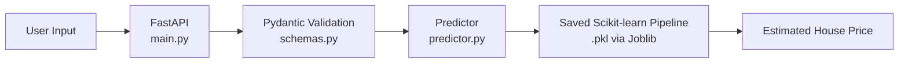

# Real Estate Price Prediction API

A Machine Learning API that estimates the **median house value** of a California census district using demographic, geographic and housing statistics.

The model is trained on the **California Housing dataset** and served through a **FastAPI** web service.

> **Note:** This is a learning project. Different ML algorithms and hyperparameter tuning techniques are evaluated step by step in the notebooks. The current model is a working prototype, and the goal is to keep refining feature engineering, pipelines and algorithms to reduce the **Root Mean Squared Error (RMSE)**.

---

## Table of Contents

- [Features](#features)
- [Tech Stack](#tech-stack)
- [How It Works](#how-it-works)
- [Repository Structure](#repository-structure)
- [Local Setup](#local-setup)
- [API Endpoints](#api-endpoints)
- [Testing the API](#testing-the-api)
- [Notebooks](#notebooks)
- [Acknowledgements](#acknowledgements)

---

## Features

- Predicts the median house value for an area from 9 input features
- Scikit-learn pipeline that handles preprocessing and prediction together
- Custom Scikit-learn transformer (`ClusterSimilarity`) used in preprocessing
- Trained pipeline saved with Joblib and loaded by the API
- Request validation with Pydantic
- Interactive API docs (Swagger UI and ReDoc) generated automatically by FastAPI

---

## Tech Stack

| Purpose | Technology |
| --- | --- |
| Language | Python |
| API framework | [FastAPI](https://fastapi.tiangolo.com/) |
| Server | [Uvicorn](https://www.uvicorn.org/) |
| Machine learning and pipelines | [Scikit-learn](https://scikit-learn.org/) |
| Data handling | [Pandas](https://pandas.pydata.org/) and [NumPy](https://numpy.org/) |
| Model serialization | [Joblib](https://joblib.readthedocs.io/) |
| Input validation | [Pydantic](https://docs.pydantic.dev/) |
| Experimentation | Jupyter Notebook |

---

## How It Works



1. The user sends housing information to the `/predict` endpoint.
2. FastAPI receives the request.
3. Pydantic validates the input.
4. The saved Scikit-learn pipeline (loaded with Joblib) processes the data.
5. The model generates a prediction.
6. The API returns the estimated housing price.

---

## Repository Structure

```
REALESTATECOMPANY/
├── app/
│   ├── main.py                 # FastAPI entry point (defines / and /predict)
│   ├── schemas.py              # UserInput Pydantic schema for request validation
│   ├── predictor.py            # Loads the joblib model and exposes the prediction helper
│   ├── custom_transformers.py  # Custom Scikit-learn transformers (e.g. ClusterSimilarity)
│   └── model/
│       └── housing_prediction_model.pkl   # Serialized Scikit-learn pipeline/model
├── datasets/
│   └── housing/
│       └── housing.csv         # California Housing dataset
├── best.ipynb                  # Data exploration, experimentation, feature engineering, RMSE tracking
├── test.ipynb                  # Data exploration, experimentation, feature engineering, RMSE tracking
├── requirements.txt            # Dependencies for the notebooks and the API
└── README.md
```

---

## Local Setup

### 1. Clone the repository

```bash
git clone https://github.com/AtulKale1011/REALESTATECOMPANY.git
cd REALESTATECOMPANY
```

### 2. Create a virtual environment (recommended)

**Windows**

```powershell
python -m venv .venv
.venv\Scripts\Activate.ps1
```

**macOS / Linux**

```bash
python3 -m venv .venv
source .venv/bin/activate
```

### 3. Install dependencies

```bash
pip install -r requirements.txt
```

### 4. Run the API

Start the Uvicorn development server from the project root:

```bash
uvicorn app.main:app --reload
```

The API will be available at `http://127.0.0.1:8000`.

---

## API Endpoints

### 1. Health Check

Checks whether the server is running.

- **Method:** `GET`
- **Path:** `/`

**Response**

```json
{
  "message": "Server is Running..."
}
```

### 2. Predict House Price

Returns the estimated median housing price for the given housing features.

- **Method:** `POST`
- **Path:** `/predict`

**Request body (JSON)**

| Field | Type | Validation | Description |
| --- | --- | --- | --- |
| `longitude` | float | None | Longitude coordinate |
| `latitude` | float | None | Latitude coordinate |
| `housing_median_age` | int | Must be `> 0` | Median age of the house |
| `total_rooms` | int | Must be `> 0` | Total number of rooms in the block |
| `total_bedrooms` | int | Must be `> 0` | Total number of bedrooms in the block |
| `population` | int | Must be `> 0` | Total population in the block |
| `households` | int | Must be `> 0` | Total households in the block |
| `median_income` | float | Must be `> 0` | Median income of households (in tens of thousands) |
| `ocean_proximity` | string | Case-insensitive | One of `"NEAR BAY"`, `"<1H OCEAN"`, `"INLAND"`, `"NEAR OCEAN"`, `"ISLAND"` |

**Sample request**

```json
{
  "longitude": -122.23,
  "latitude": 37.88,
  "housing_median_age": 41,
  "total_rooms": 880,
  "total_bedrooms": 129,
  "population": 322,
  "households": 120,
  "median_income": 8.3252,
  "ocean_proximity": "NEAR BAY"
}
```

**Sample response**

```json
{
  "Estimated Housing Price": 452600.0
}
```

---

## Testing the API

### Postman

1. Create a new request.
2. Set the method to **POST** and the URL to `http://127.0.0.1:8000/predict`.
3. Open the **Body** tab, choose **raw**, and select **JSON**.
4. Paste the sample request above and click **Send**.

### cURL

```bash
curl -X POST "http://127.0.0.1:8000/predict" \
     -H "Content-Type: application/json" \
     -d "{\"longitude\": -122.23, \"latitude\": 37.88, \"housing_median_age\": 41, \"total_rooms\": 880, \"total_bedrooms\": 129, \"population\": 322, \"households\": 120, \"median_income\": 8.3252, \"ocean_proximity\": \"NEAR BAY\"}"
```

### Interactive docs

With the server running, open:

- **Swagger UI:** `http://127.0.0.1:8000/docs`
- **ReDoc:** `http://127.0.0.1:8000/redoc`

---

## Notebooks

`best.ipynb` and `test.ipynb` are used for:

- Data exploration
- Model experimentation
- Feature engineering
- Tracking RMSE results

---